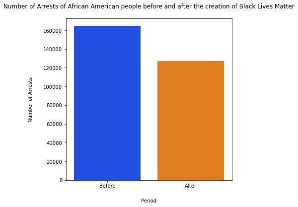
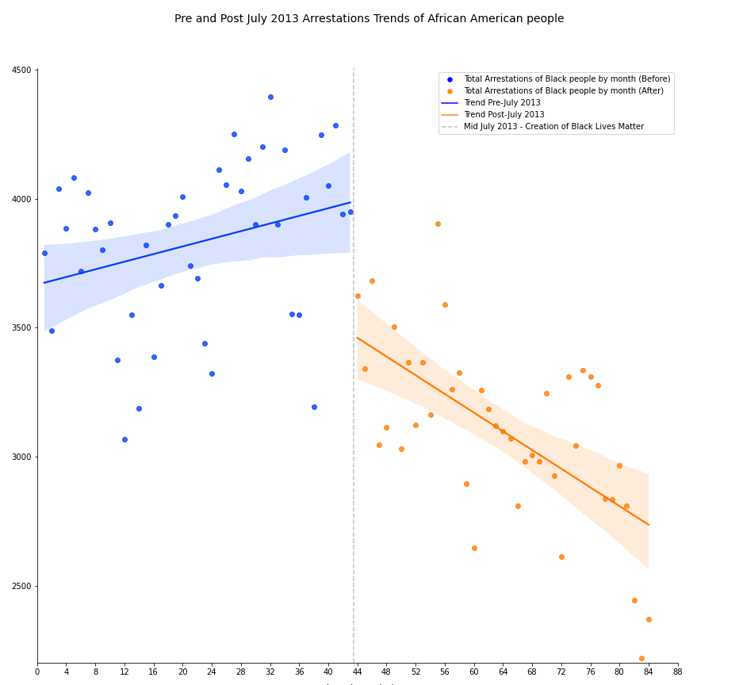
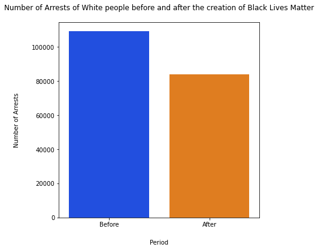
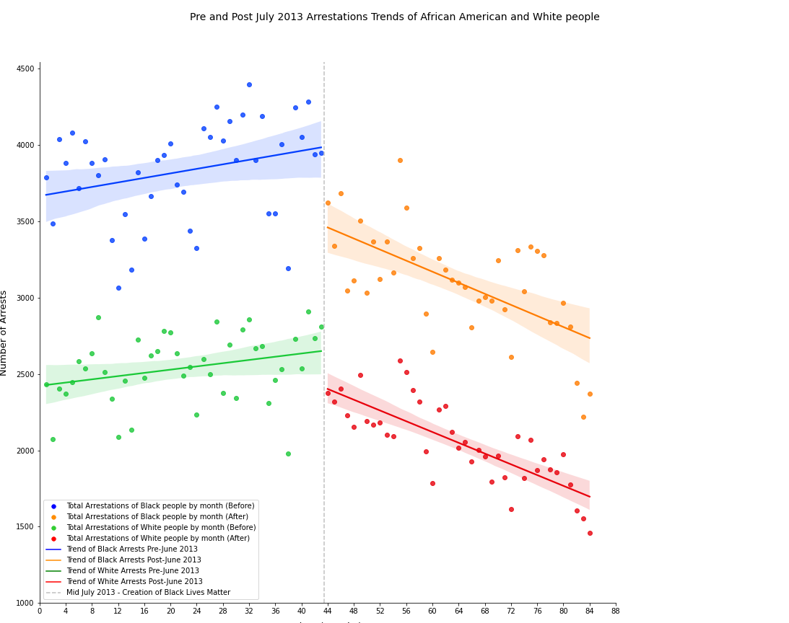
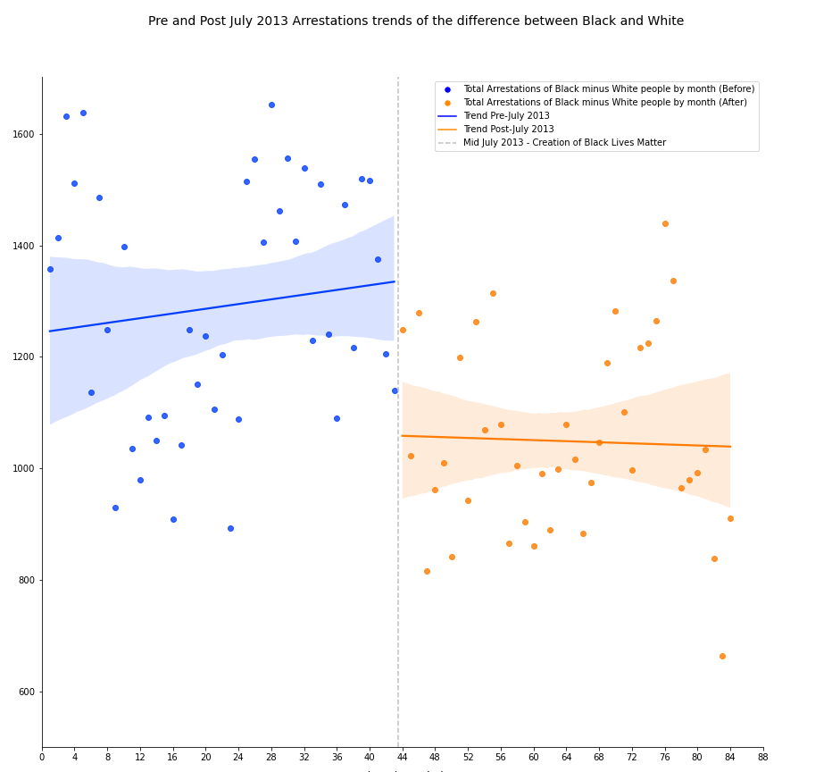
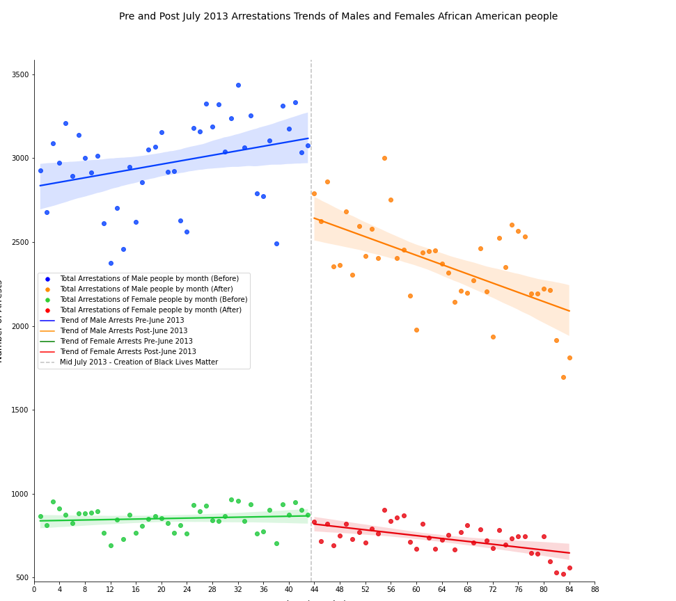

We all know the movement Black Lives Matter. In Europe, it became widely known after the death of George Floy in Minnesota, choked under the knee of the police officer in charge of his arrest. Following this event, major protests took place in various cities across the Old Continent to denounce racial inequalities and police brutality and discrimination against non-white citizens. 

But the movement Black Lives Matter was created long before. The \#BLACKLIVESMATTER first appeared on social media in the United States in July 2013. What was the starting point of this movement ? The acquittal of the neighborhood watch coordinator George Zimmerman, responsible for the shooting of the African American Trayvin Martin. This is the major event that launched the creation of the now worldwide known movement "Black Lives Matter" that aims to advocate against violence inflicted on Black communities. 

Seven years after the creation of this movement it is interesting to analyze the situation and to ask the question: did the Black Lives Matter movement manage to reduce the ratial disparities in the United States ?

To answer this question, we will study the number of arrests of African Americans in L.A. and assess the impact of the creation of this movement on the evolution of the arrests. 

___

# Are there apparent disparities in arrests with respect to the race in L.A. ?

Let's begin with a first and broad analysis of the data. What is the row number of arrestations for each race in L.A. per year ?

 
This figure shows us the annual average number of arrests from 2010 to 2019, including the period before and after the movement. And indeed, we can already see that there seems to be racial inequalities. But, we certainly need to take into account the population in each race. If there were 5 times more African American in L.A. it would be logic that they’d be 5 times more arrested ! So, for the 3 main races: Black, Hispanic and White, let's scale these numbers to obtain the annual number of arrests per person, i.e. the ratio of people within a population getting arrested.

 
Oh man this is an impressive result, and not in the good way. Apparently, African Americans are arrested almost 5 times more than Whites. Does this reflects only racial discrimination ? Let’s keep in mind that it could also reflect the uneven repartition of the races within the different social classes. In our opinion it is probably a mix of both.

___

# How African American arrestations evolved after the creation of the movement ?

Let's now focus more on Black people and how the movement impacted them. The first thing we want to see is the number of arrests before the creation of the movement vs. the number of arrests after. Was there an evolution in terms of number ?

This seems to be really good news ! This figure shows us that there was a decrese of 22% after the creation of the movement. We confirmed this difference to be statistically significant with a Welch's t-test. 
But how did it evolve ? We are interested in the trends of this evolution and thus we compute the monthly number of arrests.

This segmented regression analysis shows us that there was a significant drop of arrest in July 2013 and further more that the decreasing trend Post-July is statistically significant too. Thus we can say that there was definitely a positive change in trends and numbers after the apparition of the Black Lives Matter movement. But was this change really the result of the movement ? 
Now that we have seen the clear impact of July 2013 on the evolution of the arrests of the African Americans, let's have a look at its influence on the arrests of White people ! 

___

# How did the creation of this movement impacted White arrests ?

We all agree that the movement aims at reducing the racial disparities and at eradicating white supremacy. The Black Lives Matter movement should therefore not impact so much the arrestation trend of white people right ?

With a first look on the data, we can see that there is quite a difference between the mean of arrestations before and after July 2013. We can observe a decrease of approximately 23.04% in the total arrests of African Americans between the two periods studied (the first period being between beginning of 2010 until July 2013 and the second period being between July 2013 and end of 2016). That's not what we were expecting... The decrease in arrests is even higher for the White poeple than for the African Americans... Before jumping to any conclusion, we should have a look at the representation of the segmented regression analysis.

Well that's unfortunate, we find a similar trend for the arrests of White people and for the arrests of African Americans... The overall trend of the arrestations of White people that was rising before July 2013, is decreasing after July 2013. A drop in the number of arrests (albeit less pronounced than the one observed in the arrests of the African Americans) can also be noticed right after July 2013.
Regression analysis has even shown that July 2013 has a statistically significant importance. How could we explain that ? 

After some digging in the political history of L.A., we found that the 42nd mayor of L.A. has been elected in 2013. Eric Garcetti began his term as L.A. mayer on the 1st of July 2013. The Agenda of the new mayor is focused on converting his city into a safe, livable, and prosperous municipality. This could explain the observed decrease in the overall trend of arrests of white people.  
 
 ___

# Was the disparities between White and African Americans arrestations impacted by the creation of the movement ?

At this stage of the study, we have only studied the evolution of the arrests for different races. Has it has been shown previously, the events that occured in June 2013 (either the creation of the Black Lives Matter movement, either the nomination of the new mayor at L.A.) lead to a significant decrease in the number of arrests of African Americans and White people. 

Remember our initial question: did the Black Lives Matter movement manage to reduce the ratial disparities in the United States ? As mentioned above, up to now we only answered the question : was there a change in the arrestations of African Americans after the creation of the Black Lives Matter movement ? 

Let's go back to this first question and see whether the creation of the Black Lives Matter movement helped reduce the discrimination of African Americans (which is basically the main aim of this movement).

To address this question we can study the evolution of the difference in the number of arrests of African Amercians and White people. When the number of arrests of African Americans (respectively of White people) is reported to the size of the African American population (respectively to the size of the White population) in L.A., the difference between the number of arrests between each race can be seen as a measure of the equality between these two races: the closest to 0 (meaning that the number of arrests for each race is most similar), the less inquality there is between the races. 

Hoping this is clear enough, let's study the evolution of this difference !

In this graph, we can clearly see a drop in the total number of arrestations of Black minus the arrestations of White people. This is pretty interesting because it shows that, since July 2013, the gap between those two races has been reduced. The regression model (not presented here) support the significant importance of the intervention event (July 2013).

___

# Is there a difference betwen male and female African Americans ?

To sum up, we have shown an evolution in the trend of the arrests of Black and White people and in the differences in the arrests. 

Another question that we can now study is whether male and female African Americans are impacted the same way in terms of number of arrests after the apparition of the movement. 

.png)

You can see on the graph that the male African Americans are much more impacted by the event in July 2013 than female. The decrease in the arrests of man is at 24.232% whereas we have less than 1% decrease for the woman. We can clearly see here that woman and man are not equal.

As we can observe on the graph, both male and female arrest numbers decrease after July 2013. Yet it seems, looking at the ratios, that the number of female arrests decresed less than for the males.

___

